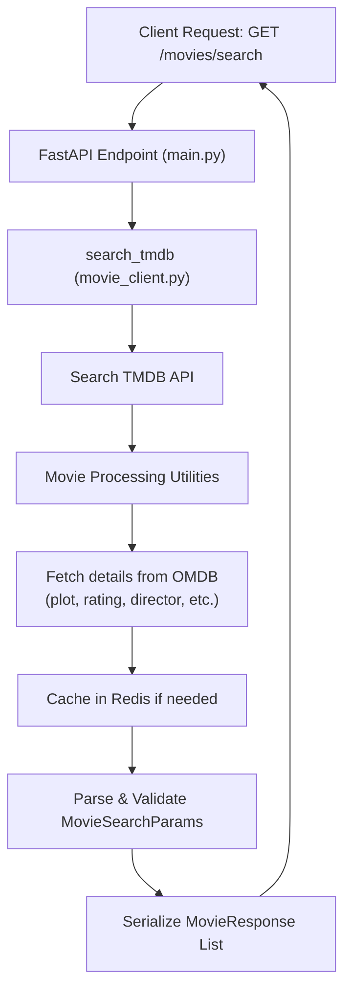

# Movie Search API Backend Task

Design and implement a RESTful API using FastAPI and Pydantic that enables users to search for movies by various criteria. The service should fetch data from at least two free external movie data providers.

---

## Table of Contents

- [Movie Search API Backend Task](#movie-search-api-backend-task)
  - [Table of Contents](#table-of-contents)
  - [Overview](#overview)
  - [Architecture Overview](#architecture-overview)
  - [Features](#features)
  - [Tech Stack](#tech-stack)
  - [Getting Started](#getting-started)
    - [Prerequisites](#prerequisites)
    - [Installation](#installation)
    - [Configuration](#configuration)
    - [Running the Application](#running-the-application)
    - [Containerization with Docker](#containerization-with-docker)
  - [API Reference](#api-reference)
    - [Search Movies Endpoint](#search-movies-endpoint)
    - [Example](#example)
      - [Request](#request)
      - [Response Examples](#response-examples)
        - [200 OK](#200-ok)
  - [Design Decisions](#design-decisions)
  - [Known Limitations \& Future Improvements](#known-limitations--future-improvements)

---

## Overview

This API enables users to search movies and TV series by multiple criteria—title, actors, type, and genre—through a single `GET /movies/search` endpoint. Under the hood, it orchestrates calls to external providers (TMDB and OMDB), normalizes and enriches results, and applies client-side filtering and caching.

## Architecture Overview

Below is a high-level flow of how a search request travels through the system:

1. **Client Request**: User invokes `GET /movies/search` with optional query parameters.
2. **FastAPI Endpoint**: Handled by `main.py`, which:
   - Parses and validates `MovieSearchParams` via Pydantic.
   - Routes to `search_tmdb` (and could be extended for OMDB).
3. **Client Layer**: In `movie_client.py`, `search_tmdb` determines search strategy:
   - Title-only ➔ `_search_by_title_only`
   - Title + filters ➔ `_search_by_title_with_filters`
   - Filters-only ➔ `_search_by_filters_only`
   - No criteria ➔ `_get_popular_fallback`
4. **Utility Layer**: In `utils/utils_movies_client.py`, helper functions:
   - `get_search_results` / `discover_by_filters` fetch raw data from TMDB.
   - `fetch_genres` loads and caches genre mappings.
   - `map_to_movie` enriches each item with credits, OMDB details, and maps into `MovieResponse`.
   - `matches` applies any leftover filtering in Python.
   - Redis-backed caching reduces repeated external calls.
5. **Response**: A list of `MovieResponse` objects is returned to the user, serialized via Pydantic.


## Features

- 🔍 Filter by title, actors, type, and genre
- ⚙️ Modular client architecture for integrating multiple providers
- 📦 Pydantic schemas for input validation and response serialization
- 🛡️ Robust error handling and HTTP status codes
- 🔄 Automated tests covering client logic and utilities

## Tech Stack

- **FastAPI**: Web framework for building APIs
- **Pydantic**: Data validation and settings management
- **HTTPX**: Asynchronous HTTP client
- **Redis & aioredis**: Caching layer for genres, popular items, and OMDB lookups
- **pytest & pytest-asyncio**: Testing framework for sync and async tests
- **Uvicorn + uvloop**: ASGI server with performance optimizations
- **python-dotenv**: Environment variable management

## Getting Started

### Prerequisites

- Python 3.9 or above
- `git` installed

### Installation

1. Clone the repository:
   ```bash
   git clone https://github.com/Omarkhaled711/Movie-Search-API-Backend.git
   cd your-repo
   ```
2. Create and activate a virtual environment:
   ```bash
   python -m venv venv
   source venv/bin/activate   # Linux/macOS
   venv\\Scripts\\activate  # Windows
   ```
3. Install dependencies:
   ```bash
   pip install -r requirements.txt
   ```

### Configuration

Configuration is managed via Pydantic's BaseSettings in config.py. This class reads environment variables (including those in .env) automatically:

1. **Obtain API Keys**:

   - **OMDB API Key**: Sign up for a free key at [https://www.omdbapi.com/apikey.aspx](https://www.omdbapi.com/apikey.aspx).
   - **TMDB API Key**: Create a free account and generate an API key at [https://www.themoviedb.org/settings/api](https://www.themoviedb.org/settings/api).

2. **Create **``** file**: In the `app/` directory, create a file named `.env` (ensure it is included in `.gitignore`).

   ```ini
   OMDB_API_KEY=your_omdb_api_key_here
   TMDB_API_KEY=your_tmdb_api_key_here
   ```

3. **Load Environment Variables**: The application loads variables from `app/.env` automatically. Ensure the `.env` file is present before starting the server.

### Running the Application

```bash
uvicorn app.main:app --reload
```

The API will be available at `http://localhost:8000` and the automatic Swagger UI at `http://localhost:8000/docs`.

### Containerization with Docker

A Dockerfile and `docker-compose.yml` are provided to run the service and Redis cache in containers.

1. **Build and run with Docker Compose**:
   ```bash
   docker-compose up --build
   ```

- API accessible at `http://localhost:8000`
- Redis service reachable via `redis:6379` inside the network.

## API Reference

FastAPI automatically generates interactive documentation at `http://localhost:8000/docs` (Swagger UI) and `http://localhost:8000/redoc` (ReDoc).

### Search Movies Endpoint

- **GET** `/movies/search`
- **Description**: Search for movies or TV series by title, actors, type, and genre.
- **Live Docs**: visit `http://localhost:8000/docs` to explore parameters, request examples, and response schemas interactively.

Refer to the [Swagger UI](/docs) for full details and try out the API directly in your browser.

### Example

#### Request

```http
localhost:8000/movies/search?title=Batman v Superman: Dawn of Justice
```

#### Response Examples

##### 200 OK

```json
[
    {
        "id": "tt2975590",
        "title": "Batman v Superman: Dawn of Justice",
        "year": 2016,
        "type": "movie",
        "genres": [
            "Action",
            "Adventure",
            "Fantasy"
        ],
        "actors": [
            "Ben Affleck",
            "Henry Cavill",
            "Jesse Eisenberg",
            "Gal Gadot",
            "Amy Adams",
            "Diane Lane",
            ...etc
        ],
        "director": "Zack Snyder",
        "runtime": "151 min",
        "plot": "Batman is manipulated by Lex Luthor to fear Superman. Superman´s existence is meanwhile dividing the world and he is framed for murder during an international crisis. The heroes clash and force the neutral Wonder Woman to reemerge.",
        "poster_url": "https://image.tmdb.org/t/p/w500/5UsK3grJvtQrtzEgqNlDljJW96w.jpg",
        "ratings": {
            "Internet Movie Database": "6.5/10",
            "Rotten Tomatoes": "28%",
            "Metacritic": "44/100"
        },
        "source": "Merged"
    }
]

```

## Design Decisions

The architecture and code organization reflect several key design choices:

1. **Layered Separation of Concerns**

   - **Endpoint Layer (**main.py**)** handles HTTP routing, request validation, and error translation.
   - **Client Layer (**calient/movie_client.py**)** encapsulates high-level search strategies (title, filters, fallback), decoupling orchestration logic from HTTP and I/O details.
   - **Utility Layer (**utils/utils_movies_client.py**)** focuses on low-level tasks—API interactions, caching, data enrichment, and filtering—promoting modularity and testability.

2. **Strategy Pattern for Search Flows**

   - A centralized decision block in `search_tmdb` selects among private methods (`_search_by_title_only`, `_search_by_title_with_filters`, etc.), making it straightforward to extend with new search modes or providers.

3. **Asynchronous, Concurrent Requests**

   - Make use of `asyncio.gather` and `httpx.AsyncClient` enables parallel fetching of search results, genres, credits, and OMDB data, reducing overall latency.

4. **Client-Side Enrichment & Filtering**

   - The `map_to_movie` function enriches raw TMDB data with credits and OMDB metadata, then `matches` applies any additional filters in Python, ensuring consistent, provider-agnostic results.

5. **Caching with Redis**

   - Frequently used data (e.g: no search params is provided (popular items fetched) or searching with titles) is cached with defined TTL values, minimizing redundant external calls and mitigating rate limits.

6. **Robust Error Handling**

   - Third-party API errors are caught and translated into HTTP 502 responses with informative messages.
   - Pydantic validation ensures malformed requests return 422 errors before business logic is invoked.

7. **Test-Driven and Mock-Friendly Design**

   - Clear separation of HTTP client dependencies allows injection of `dummy_client` fixtures for unit tests.
   - Comprehensive tests cover branching logic, caching behavior, enrichment paths, and endpoint error scenarios, supporting safe refactoring.

8. **Extensibility & Maintainability**

   - The modular design makes adding new providers or filters a matter of implementing additional client/helper functions without touching core flow logic.

## Known Limitations & Future Improvements

- **Implicit Pagination**: Currently relies on TMDB’s default pagination, with no API-level support for client-driven paging.\
  *Future Work*: Implement query parameters for `page` and `page_size` in `/movies/search` and handle paginated results across providers.

- **Better Caching Strategy**:
  - *Future Work*: Revise with the buisness analyst and technical team leader the frequently searched endpoint and make sure to cache them with the approprite TTL

- **Extended Filters**: Lacks year-range filtering, language, or user ratings.\
  *Future Work*: Expand `MovieSearchParams` and implement corresponding discovery logic.
